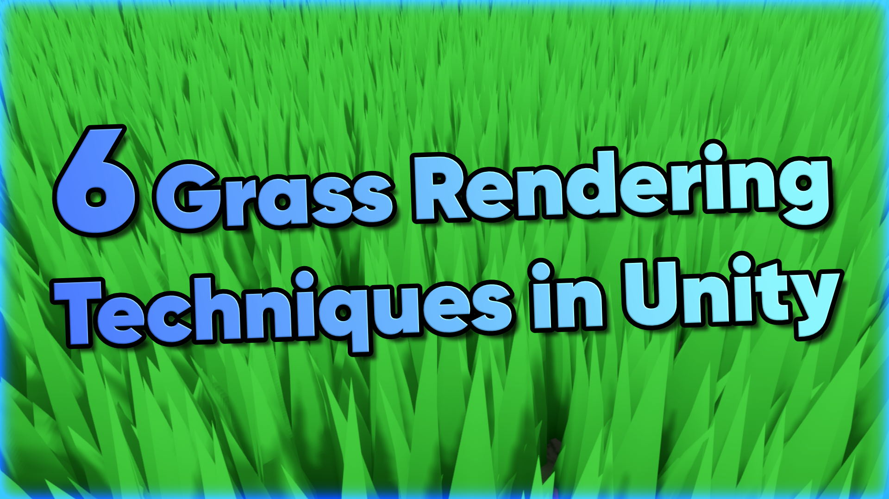

# Six Grass Rendering Techniques in Unity

Six varied methods for drawing grass with a range of use cases.

## Overview

There are many ways to render grass in Unity, and each method has its own advantages and drawbacks. This repository showcases six different techniques: mesh grass, geometry and tessellation grass, procedural rendering with compute shaders, billboarding, Unity terrains, and impostors.

## Software

This project was created using Unity 2021.3.0f1 (LTS) and URP 12.1.6.

## Tutorials

A tutorial video is available [on YouTube](https://www.youtube.com/watch?v=uHDmqfdVkak) based on this project.

## Authors

This project and the corresponding tutorials were created by Daniel Ilett.

## Release

This project was released on December 3rd 2022.
